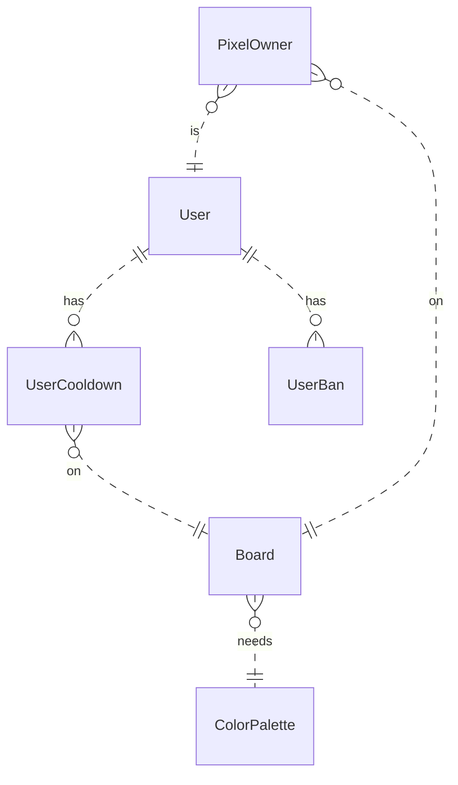
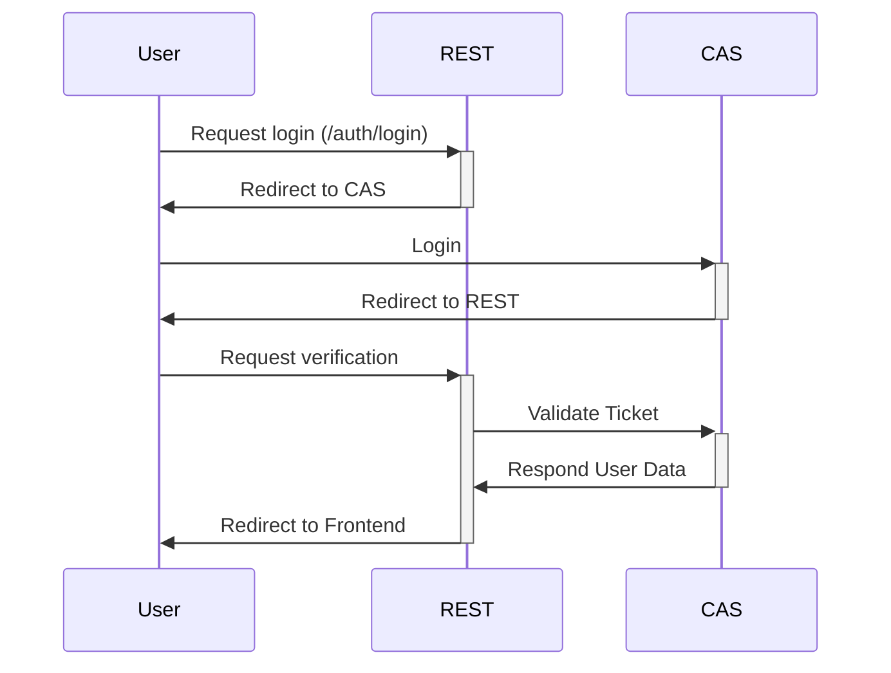

# AzPlace REST-Backend

This repository is a part of **AzPlace**, which consists of three different parts. 
This repository contains the Spring REST-Service.

To use **AzPlace** you also need these services:

- [WebSocket-Server](https://github.com/Abstractolotl/azplace-websocket-backend)
- [Frontend](https://github.com/Abstractolotl/azplace-frontend)

## Requirements

Before running this service you need the following other services:
- Redis-Server
- MariaDB-/MySQL-Server
- Elasticsearch Instance

## Database

## Login Flow

